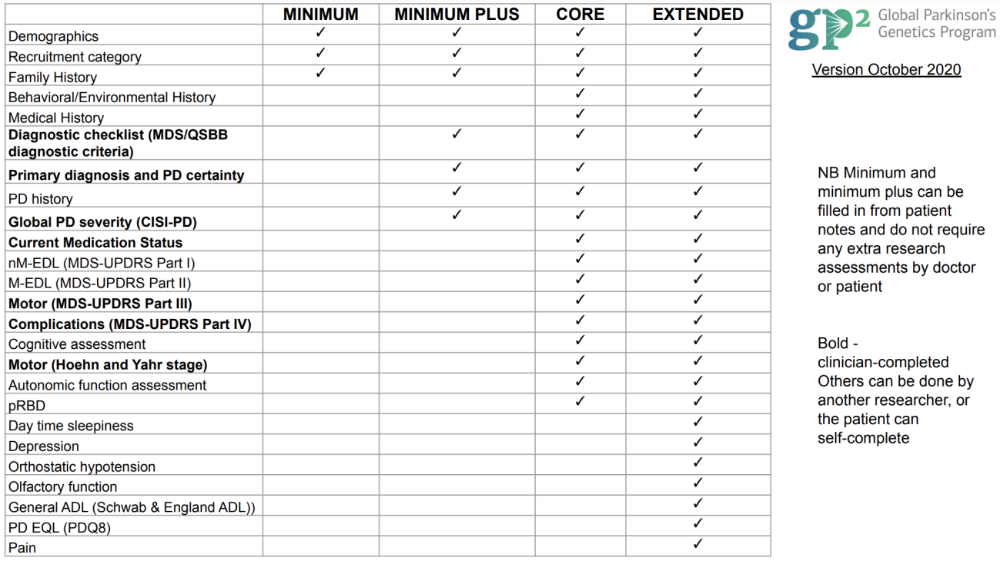

# GP2 {#sec-gp2}

## Study Description {#sec-gp2-description}

The Global Parkinson's Genetics Program (GP2) is a resource program of the Aligning Science Across Parkinson's (ASAP) initiative focused on improving understanding of the genetic architecture of Parkinson's disease (PD) by including groups traditionally underrepresented in genetics research. The ultimate goal is collecting and genotyping more than 200,000 unique samples, especially from diverse populations.

It currently includes 227 cohorts:
- 74 cohort studies with data shared to AMP® PD
- 153 that haven't shared to AMP® PD yet

**Last updated (Release 6)**: December 21st, 2023

### Genetic Data Organization

The genetic data could be found in two groups: complex disease or monogenic disease, and broken into genetically-determined ancestries:

| Code | Ancestry Description |
|------|---------------------|
| **AAC** | African American / Caribbean ancestry |
| **AFR** | African ancestry |
| **AJ** | Ashkenazi Jewish ancestry |
| **AMR** | Latino and indigenous Americas populations |
| **EUR** | General European ancestry |
| **EAS** | East Asian ancestry |
| **SAS** | South Asian ancestry |
| **FIN** | Finnish population isolate (only in complex group, no monogenic information) |
| **CAS** | Central Asian ancestry |
| **MDE** | Middle Eastern ancestry |
| **CAH** | Complex Admixture History (new in Release 6) |

### Complex Admixture History (CAH)

::: {.callout-note}
## New Ancestry Group
CAH, or Complex Admixture History, is a new ancestry group introduced to GP2 for release 6. It was created in response to a large number of samples with South African and other highly admixed individuals being incorrectly predicted as CAS (Central Asian) ancestry in release 5.
:::

For release 6, the CAH ancestry group mainly contains samples from:
- Stellenbosch University (Cape Town, South Africa)
- The Coriell Institute (Camden, New Jersey, United States)
- Parkinson's Foundation (Miami, Florida, United States)

We consider any samples labeled as CAH to be too highly admixed to be included in analyses with other GP2 ancestry groups.

### Cohort Composition

**Complex disease data (genotypes)**, including locally-restricted samples:
- **Total**: 44,831 genotyped participants
  - 24,709 PD cases
  - 17,246 Controls
  - 2,876 'Other' phenotypes

When removing the locally-restricted samples:
- **Total**: 33,436
  - 17,129 PD cases
  - 13,872 Controls
  - 2,435 'Other' phenotypes

**Monogenic disease data (whole genome sequences)**:
- **Total**: 2,324 sequenced participants
  - 1,854 PD cases
  - 314 Controls
  - 156 Other phenotypes

When removing the locally-restricted samples:
- **Total**: 2,083
  - 1,650 PD cases
  - 309 Controls
  - 124 'Other' phenotypes

**Clinical phenotyping**: 12,585 individuals who have extended clinical phenotyping information and matching genetic information.

Composition of release 6 per ancestry group is available on the [GP2 blog](https://gp2.org/blog/).

## Study Data Features {#sec-gp2-features}

### Clinical Data

Comprehensive deep clinical phenotyping data for 12,585 individuals matched with genetic information:

- Age at diagnosis and onset
- Primary, current, and latest diagnoses
- Cognitive exams such as:
  - Mini-Mental State Examination (MMSE)
  - Montreal Cognitive Assessment (MoCA)
- Movement Disorder Society-Sponsored Revision of the Unified Parkinson's Disease Rating Scale (MDS-UPDRS)
- Detailed "other" phenotypes, such as Lewy Body Dementia (LBD)

::: {.callout-note}
## Cohort-Dependent Data
Each cohort submits one of these datasets, according to their capacity, as demonstrated in the clinical data availability table.
:::

{#fig-gp2-clinical fig-alt="Table showing clinical data types available across different GP2 cohorts"}

### Neuroimaging

Not available

### Omics

Basic genomics are available:

- **Arrays**: NeuroChip and Neurobooster
- **Whole genome sequencing**

### Biomarkers

Not available

### Other

None

## How to Access Data {#sec-gp2-access}

There are two levels of access within GP2:

- **Tier 1**: Summary statistics and other non-participant level data
- **Tier 2**: Participant-level data + clinical metadata in latest releases

::: {.callout-important}
## Shared Access Process with AMP-PD
As GP2 completes cohort genotyping, all data is shared through the secured AMP® PD platform. For that reason, to request access, you must complete the steps as described in the AMP-PD registration page. This means that you request access to AMP-PD and GP2 data through the same procedure and you are granted access to both at the same time.
:::

### Access Links

- [GP2 Tier 1 Data](https://gp2.org/tier1-data/) (requires login)
- [GP2 Tier 2 Data](https://gp2.org/tier2-data/) (requires login)

### Step-by-Step Access Process

1. [AMP PD Access Request Form](https://amp-pd.org/access-request)
2. [Setting up a Google Account](https://amp-pd.org/google-account)
3. [Setting up 2-Step Verification](https://amp-pd.org/2-step-verification)
4. [Requirements for accessing genomics data](https://amp-pd.org/genomics-requirements)
5. [Full AMP PD Application Submission and Review Process](https://amp-pd.org/application-process)

### Verily Viewpoint Workbench (VWB)

Before 2024, the only way to explore and analyze GP2 Data was through Terra, and data was stored in Google buckets. Due to General Data Protection Regulation, there is part of GP2 data that is in another platform called Verily Viewpoint Workbench (VWB).

To gain access to the full release on VWB you must:

1. Have approved GP2 Tier 2 access
2. Fill out the GDPR-governed sample request form
3. Be a GP2 consortium member (contributing cohort, GP2 partner, or project analyses team member)

**Costs** depend on runtime, bytes processed, queries performed and usage of persistent disk. On webinars, they recommend that you use the default cloud environment details, and adjust them depending on the analysis you are running.

## Intended Data Uses {#sec-gp2-uses}

The primary goal of GP2 is to identify genetic variants associated with:
- Parkinson's disease risk
- Age of onset
- Disease progression
- Related clinical features

Researchers use the dataset to conduct genome-wide association studies (GWAS) and other genetic analyses to uncover novel genetic risk factors and potential therapeutic targets. GP2 datasets are made available to the broader scientific community to facilitate collaborative research and accelerate discoveries.

GP2 datasets also serve as valuable resources for validating and replicating findings from previous genetic studies of Parkinson's disease.

## Data Set Strengths {#sec-gp2-strengths}

1. **Diverse ancestry information** - provides data from underrepresented populations

2. **Continuously being updated and improved** - regular releases with more data

3. **Training opportunities** - if you are part of GP2 you could get trained and learn in the process of accessing the data

4. **Cohort browser access** - summary of the information could be accessed through the cohort browser

5. **Quality control** - QC has been done for the genetic analysis (genotools)

6. **Related individuals removed** - in latest version

7. **Code repository** - codes available in GP2 learning platform with guided material

8. **Open office hours** - available every week

9. **Project support** - you can propose projects and get financial support for running analysis + project manager assigned

10. **Collaborative environment** - you can see projects currently being carried out to avoid duplication + join them

## Data Set Limitations {#sec-gp2-limitations}

1. **Delay to get access** to the dataset

2. **Terra performance** - use through Terra slows the analysis

3. **Membership requirements** - new data is restricted to GP2 members

4. **Heterogeneity of the data** - varies by contributing cohort

5. **No imaging nor biomarkers data** available

6. **Cross-sectional data** - no longitudinal follow-up

7. **Fixed quality control** - QC has been done for all samples (so you cannot change parameters)

## Pre-Existing Documentation/FAQs/Study Contact {#sec-gp2-docs}

### Resources

- [Policies, guidelines and other resources](https://gp2.org/resources/)
- [Cohort Dashboard](https://gp2.org/cohort-dashboard/)
- [Monogenic Resource Map](https://gp2.org/monogenic-map/)
- [Monogenic Portal](https://gp2.org/monogenic-portal/)
- [Data repository](https://gp2.org/data-repository/)
- [GP2's opportunities page](https://gp2.org/opportunities/)
- [GP2 training resources](https://gp2.org/training/) (including on Terra, bioinformatics, PD, research methods, Python, and more!)

### Code Repositories

All GP2 code, and tools for data analysis are available on Github at the official [Global Parkinson's Genetics Program (GP2) code repositories](https://github.com/GP2code).

### Contact

Email [cohort@gp2.org](mailto:cohort@gp2.org) to inquire about submitting cohort samples and joining the consortium.

## Tips and Dataset Considerations {#sec-gp2-tips}

::: {.callout-warning}
## Important Considerations

- **Missing values**: There are a lot of missing values as the dataset depends on which cohort is submitting the data.

- **Partial rare variant information**: The results that appear in the cohort browser for rare variants are only for some genes, so you have partial information.

- **Project proposals**: For gaining access you have to present a project proposal, and you don't know if your idea has already been under analysis, so you could waste time on this process.
:::

## Updates {#sec-gp2-updates}

[GP2 Updates](https://gp2.org/updates/) will provide updates on the newest releases and findings pertaining to GP2.

The most recent update (at time of this draft) was announced in January 2024.
