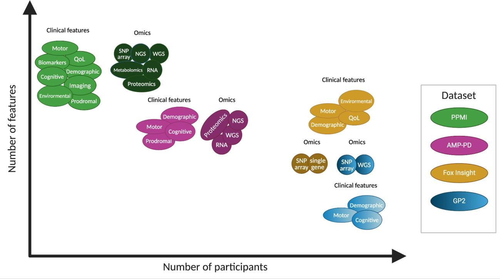

# Dataset Overview {#sec-overview}

This section provides a comprehensive comparison of the four major Parkinson's disease datasets covered in this guide. Use these tables to quickly determine which dataset best suits your research question.

## Metatable of Study Characteristics

This table enables researchers to determine which data best suits their research question of interest. It provides an overview of the types of analyses supported, sizes of the respective cohorts, modalities of data available, and the clinical features each study covers.

::: {.callout-note}
## Data Currency
These data are accurate as of April 2024.
:::

### Types of Analyses Supported

| Analysis Type | PPMI (Clinic) | AMP PD (Aggregated) | GP2 | FOX INSIGHT |
|--------------|---------------|---------------------|-----|-------------|
| **Polygenic risk score generation** | Yes | Yes | Yes | Yes |
| **Genome-wide association studies** | Yes | No (only WGS or GWAS w/federated GP2 data) | Yes | - |
| **Cross-sectional** | Yes | Yes | Yes | Yes |
| **Longitudinal** | Yes | Yes | No | Yes |

### Cohort Sizes

| Population | PPMI | AMP PD | GP2 | FOX INSIGHT |
|-----------|------|---------|-----|-------------|
| **PD** | 1,521 (902 PD, 619 prodromal) | 3,375 | 24,709 (genotyped) 2,324 (WGS) | 38,635 (10,669 genotyped + 419 microbiome) |
| **Non-PD** | 237 | 7,100 | 17,246 (genotyped) 17,246 (WGS) | 16,168 |

### Modalities of Data

| Data Type | PPMI | AMP PD | GP2 | FOX INSIGHT |
|-----------|------|---------|-----|-------------|
| **Genetic data** | Yes | Yes | Yes | Yes |
| **Biologic data** | Yes | Yes | No | No |
| **Imaging data** | Yes | No | No | No |
| **Patient-reported outcome data** | Yes (via PPMI-Online) | No | No | Yes |
| **Microbiome data (stool)** | Yes | No | No | Yes |

### Types of Clinical Data Present

| Clinical Feature | PPMI | AMP PD | GP2 | FOX INSIGHT |
|-----------------|------|---------|-----|-------------|
| **Motor** | Yes | Yes | Yes | Yes |
| **Non-Motor** | Yes | Yes | Yes | Yes |
| **Quality of Life** | No | Yes | Some | Yes |
| **Cognition** | Yes | Yes | Yes | Yes |

## Dataset Features Visualization

The following graphic provides a visual overview of clinical and omics features across different datasets in relation to number of different features and dataset sample size.

- **Solid-filled bubbles** correspond to datasets that possess longitudinal data
- **Gradient-filled bubbles** correspond to datasets only with cross-sectional data

{#fig-features fig-alt="Bubble chart comparing dataset features"}

## Choosing the Right Dataset

When selecting a dataset for your research, consider:

1. **Research Question** - Does your question require longitudinal data, imaging, or specific biomarkers?
2. **Sample Size** - Do you need large cohorts for genetic studies or smaller, well-characterized cohorts?
3. **Data Modalities** - What types of data (clinical, genetic, imaging, etc.) does your analysis require?
4. **Population Diversity** - Does your research benefit from diverse ancestries (GP2) or specific cohorts?
5. **Access Requirements** - What are the time and resource constraints for data access?

## Next Steps

Explore the detailed chapters for each dataset:

- [AMP PD](amp-pd.qmd) - Harmonized multi-cohort dataset with proteomics and transcriptomics
- [PPMI](ppmi.qmd) - Longitudinal cohort with comprehensive neuroimaging
- [GP2](gp2.qmd) - Large-scale genetics program with diverse populations
- [FOX INSIGHT](fox-insight.qmd) - Online longitudinal study with patient-reported outcomes
